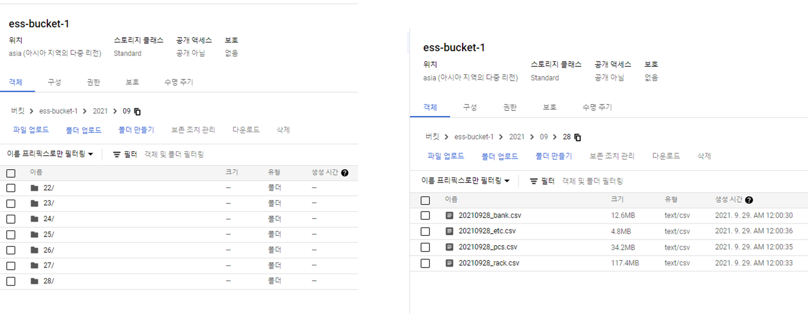

# Data ingestion (데이터 수집 시스템)

> 한국전자기술연구원 윤태일 연구원 / taeil777@keti.re.kr


## 개요
  대규모 분산에너지 저장장치 인프라의 안전한 자율운영 및 성능 평가를 위한 지능형 안전SW 프레임워크를 개발하기 위해 퍼블릭 클라우드 기반 에너지 데이터 수집‧저장 시스템의 일부로 태양광 ESS에서 측정되는 데이터를 수집하고 이를 규격화하여 퍼블릭 클라우드에 축적한다.


</br>

-----


## (1) 데이터 수집  


  - ### Modbus TCP 프로토콜 기반 수집 데이터 명세서에 따른 파싱 모듈 개발 

    - ModbusClient 라이브러리 pyModbusTCP 모듈의 경우 inputregister는 한 번에 최대 125개의 값만 가져올 수 있기 때문에 수집 데이터 명세서 기준에 따라 파싱 모듈을 설계 및 개발함

    </br>


  - ### 공통 데이터 규격 문서 기반 전처리 모듈 구조 설계 및 모듈 개발 
    
    - Modbus TCP 프로토콜의 경우 비트단위로 데이터를 전달하기 때문에 수신하는 쪽에서 음수변환 및 Scale factor에 의한 후처리가 필수적임
    
    - 수집되는 데이터의 이상치 판별을 위해 데이터 범위를 확인함 

    - 위 기능과 공통 데이터 규격 문서를 참고하여 수집되는 데이터의 활용을 위한 DB스키마 구조에 맞게 저장될 수 있도록 전처리 모듈 구조 설계 및 개발

    (공통데이터규격 문서 업로드 예정)

    </br>

  - ### 퍼블릭 클라우드(Google Cloud Platform) 상 TimescaleDB 기반으로 전처리된 수집 데이터 저장

    - GCP 인스턴스에 구축되어있는 TimescaleDB에 hypertable을 생성하고 데이터를 input할 수 있는 모듈을 작성(timescale_input_data.py)

    - 작성된 모듈을 사용하여 전처리된 데이터를 실시간 수집 

   
  - ### 코드 사용법
    1. modbus_client_oper1.py 에 접속할 IP와 포트번호를 입력
    2. timescale_input_data.py 에 저장할 timescaleDB 의 IP와 포트번호 입력
    3. 코드 실행

    </br>

    - ```
        $ python3 modbus_client_oper1.py
        ```

  - ### 수집 결과
    
   (저장된 BANK 데이터)

  </br>

-----

## (2) 데이터 축적


  - ### TimescaleDB를 통해 저장 데이터의 CSV 파일 변환 및 GCS(Google Cloud Storage) 버킷에 연-월-일 날짜별 데이터 축적
    - GCS에 접근할 수 있는 키 발급 (Json)
    - GCS 접근 및 객체 생성, 저장 기능의 GCS 모듈 개발
    - TimescaleDB에 접근 후 하루치 데이터를 연-월-일-테이블명 양식의 .csv파일로 export
    - 작성된 모듈을 통해 생성된 .csv파일을 연-월-일 날짜별로 GCS 버킷에 업로드
    - Linux 서버 상의 crontab을 통해 매일 자정에 코드 실행

    </br>

     - ```
        # 매일 자정에 실행되는 crontab 
        0 0 * * * python3 /gcs_data_accumulate.py
        ```

    -   
    (GCS 버킷에 날짜별로 저장된 csv파일)
  
    </br>


  - ### 코드 사용법
    1. gcp_storage.py 에 GCP프로젝트명, 버킷명, JSON 키 경로 입력
    2. timescale_input_data.py 에서 데이터를 불러올 timescaleDB 의 IP와 포트번호 입력
    3. 코드 실행

    </br>

    - ```
        $ python3 gcs_data_accumulate.py
        ```
    


